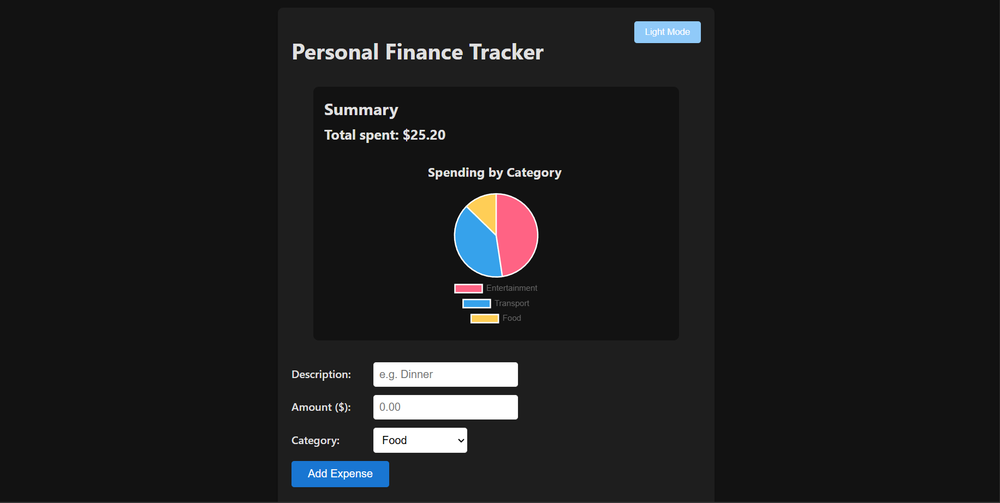
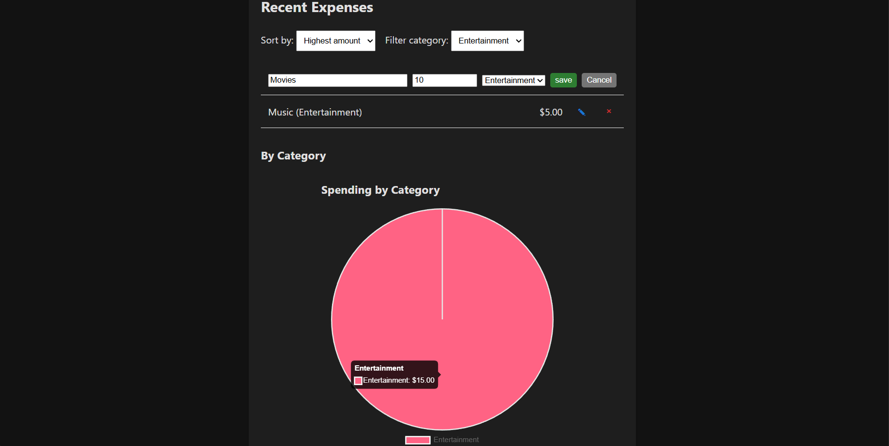

# Personal Finance Tracker

Simple React + TypeScript web app for tracking expenses. Built to demonstrate frontend skills for banking application development.

## Features
- Add, edit, delete expenses
- Persist data with localStorage
- Real-time total and category summary
- Pie chart visualization (Chart.js)
- Sort and filter expenses
- Dark/light mode toggle
- Form validation and success feedback
- CSS animations and SASS styling

## Setup
1. Clone repo
2. `npm install`
3. `npm start`

Runs on http://localhost:3000

## User Manual
- Enter description, amount, category → Add Expense
- Click ✎ to edit an entry, × to delete
- Use sort/filter dropdowns to organize list
- Toggle dark mode top-right for better viewing
- Data saved in browser — clears on "Clear All"

## Tech Stack
- React + TypeScript
- SASS for styling
- Chart.js for visualization
- localStorage for persistence

For handover: Code is modular (separate components). Easy to extend with backend API later.

## 📸 UI Preview 

